# KUET CSE Class Routine Maker: Comprehensive Technical Documentation & Study Guide

**Department of Computer Science and Engineering**  
**Khulna University of Engineering & Technology (KUET)**  
*Automated Class Timetabling System powered by Google OR-Tools CP-SAT*

> 🚀 **Live Interactive Web Simulation**: Open [http://localhost:8000](http://localhost:8000/) in your browser to instantly visualize, simulate, and interact with the live scheduling system.

---

## Table of Contents
1. [Executive Overview & System Architecture](#1-executive-overview--system-architecture)
2. [End-to-End System Workflow](#2-end-to-end-system-workflow)
3. [Core Features & Functional Capabilities](#3-core-features--functional-capabilities)
   - 3.1 [Faculty & Teacher Management](#31-faculty--teacher-management)
   - 3.2 [Academic Curriculum & Course Management](#32-academic-curriculum--course-management)
   - 3.3 [Dynamic Term Status Control (Running vs Inactive)](#33-dynamic-term-status-control-running-vs-inactive)
   - 3.4 [Course Assignment & Co-Teaching Framework](#34-course-assignment--co-teaching-framework)
   - 3.5 [Master Routine & Multi-Perspective Viewing](#35-master-routine--multi-perspective-viewing)
   - 3.6 [Incremental / Freeze Routine Generation](#36-incremental--freeze-routine-generation)
   - 3.7 [Independent Verification & Multi-Format Exports](#37-independent-verification--multi-format-exports)
4. [Mathematical Formulation & CP-SAT Solver Logic](#4-mathematical-formulation--cp-sat-solver-logic)
   - 4.1 [Time Grid & Slot Topology](#41-time-grid--slot-topology)
   - 4.2 [Decision Variables](#42-decision-variables)
   - 4.3 [Hard Constraints (Logic & Code Implementation)](#43-hard-constraints-logic--code-implementation)
   - 4.4 [Soft Constraints & Objective Function](#44-soft-constraints--objective-function)
   - 4.5 [Two-Phase Solving Pipeline](#45-two-phase-solving-pipeline)
5. [Visual Walkthrough & Feature Verification](#5-visual-walkthrough--feature-verification)
6. [Operational Scenario: Preserving Running Routines](#6-operational-scenario-preserving-running-routines)
7. [Conclusion & System Summary](#7-conclusion--system-summary)

---

## 1. Executive Overview & System Architecture

The **KUET CSE Class Routine Maker** is an enterprise-grade automated academic scheduling platform engineered to solve the NP-hard University Timetabling Problem (UTP). In a university environment like KUET CSE, scheduling involves complex, non-linear constraints:
- Accommodating multiple student cohorts across semesters simultaneously.
- Respecting teacher teaching load caps and individual availability blocks.
- Allocating specialized laboratory rooms (CSE Labs, AI Lab, Network Lab, Chemistry Lab, ECE Lab).
- Coordinating co-teaching arrangements (theory co-taught by 2 professors with shared sessions).
- Synchronizing bi-weekly alternating 0.75-credit sessional pairs (e.g., `HUM1108` and `PHY1108`).
- **Preserving ongoing running timetables** when one term finishes and a new term begins without disrupting unchanged batches.

### System Architecture Diagram

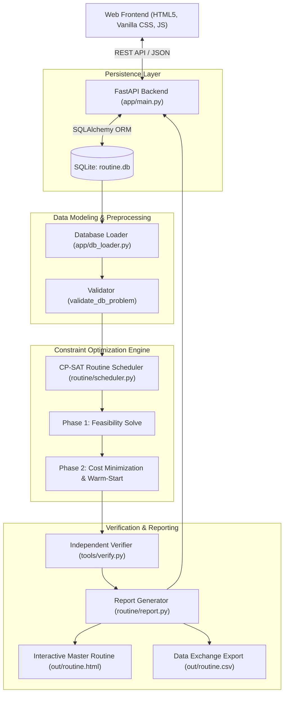

---

## 2. End-to-End System Workflow

The lifecycle of routine generation follows a deterministic 7-stage pipeline:

1. **Academic Configuration**: Faculty members, departments, daily limits, and availability blocks are configured.
2. **Curriculum Definition**: The 8 academic terms (`1-1` through `4-2`) are seeded with course credits, room kinds, categories (core, optional-II, optional-III), and paired lab relationships.
3. **Term Activation**: Batches currently in session are set to **`ON` (Running)**. Terms currently on vacation or awaiting commencement are marked **`OFF` (Inactive)**.
4. **Teacher Assignment**: For active terms, teachers are assigned to theory courses (Teacher 1, Teacher 2) and laboratory sessions.
5. **Constraint Compilation**: When generation is triggered, `app/db_loader.py` compiles active database records into discrete `Problem`, `Course`, and `Event` instances, assigning home rooms and pre-validating feasibility.
6. **CP-SAT Constraint Programming**:
   - In **Incremental Mode**, frozen batch placements are queried from `scheduled_assignments` and pinned as hard equalities in the CP-SAT model.
   - The solver executes Phase 1 (feasibility) and Phase 2 (optimality), finding legal room-slot assignments that minimize student and faculty timetable gaps.
7. **Post-Solve Verification & Persistence**: `tools/verify.py` independently verifies 100% of hard constraints. The placements are committed to `scheduled_assignments` in the database, and `out/routine.html` and `out/routine.csv` are rendered.

---

## 3. Core Features & Functional Capabilities

### 3.1 Faculty & Teacher Management
- **Teacher Directory**: Manage teacher profiles, short codes (e.g., `MMA`, `AH`, `TR`), department affiliation (`CSE`, `ECE`, `EEE`, `MATH`, `PHY`, `HUM`), and daily period ceilings (default: 5 periods/day).
- **Availability Matrix**: Teachers can mark specific days or periods as unavailable (e.g., sabbatical, administrative duties, graduate supervision).
- **Workload Tracking**: The system calculates live weekly teaching loads and alerts administrators if assignments exceed sustainable limits.

### 3.2 Academic Curriculum & Course Management
- **Full Undergraduate Catalog**: All 8 terms of the KUET CSE undergraduate curriculum (`1-1` to `4-2`) are organized in strict canonical sequence.
- **Categorization & Credits**:
  - Theory courses (2.0 or 3.0 credits, meeting 2 or 3 times/week in 1-period blocks).
  - Standard Sessional courses (1.5 or 3.0 credits, meeting in 3-period lab blocks).
  - Bi-weekly alternating sessionals (0.75 credits, 3-period blocks shared with partner courses).
  - Elective tracks in 4th Year 2nd Term: **Optional-II** (17 theory electives) and **Optional-III** (5 theory electives + 5 lab electives).
- **Room Kind Requirements**: Theory rooms (`theory`, `year1_theory`) and specialized laboratories (`cse_lab`, `ai_lab`, `network_lab`, `chem_lab`, `ece_lab`).

### 3.3 Dynamic Term Status Control (Running vs Inactive)
- **Status Toggle (`ON` / `OFF`)**: Administrators can toggle term status with a single click.
- **Strict Information Hiding for Inactive Terms**:
  - Inactive terms display only basic curriculum metadata (code, title, credits) with **no teachers assigned**.
  - Inactive terms are automatically hidden from the Assignment section to eliminate visual clutter.
  - As soon as a term is activated (`ON`), its courses become available in Assignments and its routine is generated.

### 3.4 Course Assignment & Co-Teaching Framework
- **Theory Co-Teaching Pattern**: Under KUET academic convention, a 3-credit theory course is shared by two faculty members:
  - **Meeting 1**: Taught individually by Teacher 1.
  - **Meeting 2**: Taught individually by Teacher 2.
  - **Meeting 3**: Shared session co-taught by Teacher 1 and Teacher 2 (e.g., `TR/NFS`).
- **Laboratory Mentorship**: Multiple teachers can be assigned to different sections (`A`, `B`) and groups (`G1`, `G2`).
- **Term-Wise Cascading Dropdowns**: Filters enable quick navigation across large course lists.

### 3.5 Master Routine & Multi-Perspective Viewing
- **Three Comprehensive Master Perspectives**:
  1. **Teachers Master Routine**: All faculty members plotted on a unified grid.
  2. **Labs & Rooms Master Routine**: Every laboratory and homeroom plotted with current occupancy.
  3. **Batches & Sections Master Routine**: Every student section (`1-1 A`, `1-1 B`, etc.) organized in curriculum order.
- **Live Search & Instant Filtering**: Instantly highlights matching courses, faculty, or rooms across hundreds of timetable cells.
- **Individual Faculty Cards**: Searchable dropdown to display an individual professor's weekly schedule with print capability.

### 3.6 Incremental / Freeze Routine Generation
- **The Challenge**: Traditional algorithms reshuffle the entire university timetable whenever any single batch requires rescheduling.
- **The Solution**: The Routine Maker introduces **Freeze Mode**:
  - Administrators select which running terms to preserve (e.g., `1-1`, `2-1`, `2-2`, `3-2`).
  - The CP-SAT solver pins every event of frozen terms to its exact prior room and timeslot.
  - The solver schedules incoming terms (e.g., `4-2`) into the remaining slots and rooms with **zero disruption** to existing batches.

### 3.7 Independent Verification & Multi-Format Exports
- **Independent Verification (`tools/verify.py`)**: A separate auditing algorithm inspects the final output against all hard constraints (no double booking, room capacity, teacher clashes, spread rules) and verifies 0 faults.
- **Printable Responsive HTML (`out/routine.html`)**: Beautiful, academic light-themed printable routine with tabbed batch schedules.
- **CSV Data Exchange (`out/routine.csv`)**: Normalized tabular export suitable for university ERP systems and registrar archives.

---

## 4. Mathematical Formulation & CP-SAT Solver Logic

The scheduling engine is implemented in [routine/scheduler.py](file:///f:/routine_maker/routine/scheduler.py) using the **Google OR-Tools CP-SAT** constraint satisfaction and optimization solver.

### 4.1 Time Grid & Slot Topology
The academic week is represented as a discrete 1-dimensional integer time grid:
- $D = \{0, 1, 2, 3, 4\}$ (Sunday to Thursday, $n_{\text{days}} = 5$)
- $P = \{0, 1, 2, 3, 4, 5, 6, 7, 8\}$ (Periods P1 to P9, $n_{\text{periods}} = 9$)
- Total continuous slots:
  $$S = n_{\text{days}} \times n_{\text{periods}} = 5 \times 9 = 45 \text{ slots}, \quad s \in [0, 44]$$
- Mapping function:
  $$\text{slot}(d, p) = d \times n_{\text{periods}} + p, \quad d = \lfloor s / n_{\text{periods}} \rfloor, \quad p = s \pmod{n_{\text{periods}}}$$

Break periods are preserved as hard temporal boundaries across which no multi-period lab block can straddle:
- **Snack Break**: After Period P3 (between slots 2 and 3).
- **Lunch & Prayer Break**: After Period P6 (between slots 5 and 6).

### 4.2 Decision Variables

For each meeting event $e \in E$, room $r \in R_e$, and starting slot $s \in S_e$:
$$x_{e, r, s} \in \{0, 1\}$$
where $x_{e, r, s} = 1$ if event $e$ begins at slot $s$ in room $r$, and $0$ otherwise.

Integer slot variable representing the start time of event $e$:
$$S_e \in [0, 44], \quad S_e = \sum_{r \in R_e} \sum_{s \in S_e} s \cdot x_{e, r, s}$$

---

### 4.3 Hard Constraints (Logic & Code Implementation)

#### Constraint 1: Exact Event Placement
Every required class meeting must be scheduled in exactly one room and starting timeslot:
$$\sum_{r \in R_e} \sum_{s \in S_e} x_{e, r, s} = 1, \quad \forall e \in E$$
- **Code Reference**: [routine/scheduler.py:145](file:///f:/routine_maker/routine/scheduler.py#L145)
  ```python
  self.model.AddExactlyOne(cells.values())
  ```

---

#### Constraint 2: Student Cohort Non-Overlap (No Student Clashes)
A student cohort is identified by the triplet $(b, \text{sec}, g)$ representing Batch, Section, and Group. A theory class occupies all groups of its section; a lab occupies only its designated group. At any slot $t$, a student cohort can attend at most one class:
$$\sum_{e \in E(c)} \sum_{\substack{(r, s): \\ s \le t < s + \text{len}(e)}} x_{e, r, s} \le 1, \quad \forall c \in \text{Cohorts}, \; \forall t \in [0, 44]$$
- **Code Reference**: [routine/scheduler.py:153-167](file:///f:/routine_maker/routine/scheduler.py#L153-L167)
  ```python
  def _c_cohort_conflicts(self) -> None:
      for cohort in self.p.cohorts():
          events = [ev for ev in self.p.events if cohort in self.p.cohorts_of(ev)]
          for t in range(self.grid.n_slots):
              active = [var for ev in events for var in self._active_at(ev, t)]
              if len(active) > 1:
                  self.model.Add(sum(active) <= 1)
  ```

---

#### Constraint 3: Teacher Availability & Non-Overlap
No teacher can teach more than one class at the same time, and no teacher can be scheduled during their blocked slots $U(t)$:
$$\sum_{e \in E(t)} \sum_{\substack{(r, s): \\ s \le \tau < s + \text{len}(e)}} x_{e, r, s} \le 1, \quad \forall \text{teacher } t, \; \forall \tau \in [0, 44] \setminus U(t)$$
- **Code Reference**: [routine/scheduler.py:169-208](file:///f:/routine_maker/routine/scheduler.py#L169-L208)
  ```python
  def _c_teacher_conflicts(self) -> None:
      for tid, teacher in self.p.teachers.items():
          events = [ev for ev in self.p.events if tid in ev.teacher_ids]
          for t in range(self.grid.n_slots):
              active = [var for ev in events for var in self._active_at(ev, t)]
              if t in teacher.unavailable:
                  for var in active:
                      self.model.Add(var == 0)
              elif len(active) > 1:
                  self.model.Add(sum(active) <= 1)
  ```

---

#### Constraint 4: Room Non-Overlap & Capacity
A room cannot host multiple events simultaneously:
$$\sum_{e \in E} \sum_{\substack{s: \\ s \le t < s + \text{len}(e)}} x_{e, r, s} \le 1, \quad \forall r \in R, \; \forall t \in [0, 44]$$
Additionally, feasible rooms $R_e$ for event $e$ are filtered before variable creation such that $\text{capacity}(r) \ge \text{size}(e)$ and $\text{kind}(r) == \text{room\_kind}(e)$.
- **Code Reference**: [routine/scheduler.py:210-221](file:///f:/routine_maker/routine/scheduler.py#L210-L221)
  ```python
  def _c_room_conflicts(self) -> None:
      for r in self.p.rooms:
          for t in range(self.grid.n_slots):
              active = [var for ev in self.p.events for var in self._active_at_room(ev, r, t)]
              if len(active) > 1:
                  self.model.Add(sum(active) <= 1)
  ```

---

#### Constraint 5: Theory Spread Across Days & Section Symmetry
To ensure balanced pedagogy, multiple meetings of the same theory course within a section must be held on **different days**:
$$\lfloor S_{e_1} / n_{\text{periods}} \rfloor \ne \lfloor S_{e_2} / n_{\text{periods}} \rfloor, \quad \forall e_1, e_2 \in \text{Meetings}(c, \text{sec})$$
Furthermore, if Teacher 1 and Teacher 2 co-teach Sections A and B, their individual teaching days are synchronized to align with faculty commute schedules.
- **Code Reference**: [routine/scheduler.py:245-280](file:///f:/routine_maker/routine/scheduler.py#L245-L280)
  ```python
  def _c_theory_spread_and_symmetry(self) -> None:
      for (code, sec), evs in meetings.items():
          for i in range(len(evs)):
              for j in range(i + 1, len(evs)):
                  # Distinct days
                  d1 = self._event_day_var(evs[i].eid)
                  d2 = self._event_day_var(evs[j].eid)
                  self.model.Add(d1 != d2)
  ```

---

#### Constraint 6: Laboratory Group Synchronization
When a section is divided into Groups G1 and G2 for standard sessionals, both groups should take their respective labs in the **exact same timeslot** (in different lab rooms) so that neither group sits idle while the other is in class:
$$S_{e_{\text{G1}}} = S_{e_{\text{G2}}}$$
- **Code Reference**: [routine/scheduler.py:282-297](file:///f:/routine_maker/routine/scheduler.py#L282-L297)
  ```python
  def _c_sync_group_labs(self) -> None:
      for (batch_id, sec), labs in by_sec.items():
          for lab1 in labs:
              for lab2 in labs:
                  if lab1.group == "G1" and lab2.group == "G2":
                      self.model.Add(self.slot_var[lab1.eid] == self.slot_var[lab2.eid])
  ```

---

#### Constraint 7: Bi-Weekly Paired 0.75-Credit Lab Synchronization
In 1st Year 1st Term, `HUM1108` and `PHY1108` each have 0.75 credits and meet bi-weekly. Section students are split so Group G1 takes `HUM1108` while Group G2 takes `PHY1108` during odd weeks, and they swap during even weeks. The solver locks both events into the **same simultaneous 3-period block**:
$$S_{\text{HUM1108}} = S_{\text{PHY1108}}$$
- **Code Reference**: [routine/scheduler.py:299-306](file:///f:/routine_maker/routine/scheduler.py#L299-L306)
  ```python
  def _c_sync_paired_labs(self) -> None:
      for ev in self.p.events:
          if ev.paired_event_id is not None:
              pid = ev.paired_event_id
              self.model.Add(self.slot_var[ev.eid] == self.slot_var[pid])
  ```

---

#### Constraint 8: Incremental Routine Freeze Constraint
When running routine generation in **Incremental Mode**, events belonging to running batches designated to stay unchanged are pinned to their exact previous placements $(r^*, s^*)$:
$$x_{e, r^*, s^*} = 1, \quad \forall e \in E_{\text{frozen}}$$
This forces CP-SAT to keep existing timetables completely fixed while scheduling incoming terms around them.
- **Code Reference**: [routine/scheduler.py:307-325](file:///f:/routine_maker/routine/scheduler.py#L307-L325)
  ```python
  def _c_freeze(self, freeze: dict[int, tuple[str, int]]) -> None:
      for eid, (room_id, start) in freeze.items():
          cells = self.x.get(eid)
          if not cells:
              continue
          key = (room_id, start)
          self.model.Add(cells[key] == 1)
  ```

---

### 4.4 Soft Constraints & Objective Function

The solver optimizes timetable quality using a weighted penalty objective function:
$$\min Z = \sum_{k} w_k \cdot \text{Penalty}_k$$

| Soft Constraint | Weight ($w_k$) | Objective Rationale |
|:---|:---:|:---|
| `cohort_gap` | 8 | Minimizes idle waiting periods for student groups between classes. |
| `teacher_gap` | 4 | Minimizes empty waiting periods between teaching sessions for faculty. |
| `last_period` | 2 | Discourages scheduling classes into late afternoon slots (P8, P9). |
| `teacher_daily_overload` | 6 | Penalizes assigning a teacher more than 4 periods in a single day. |
| `consecutive_overrun` | 5 | Penalizes forcing students to attend more than 3 consecutive theory classes. |
| `room_churn` | 4 | Keeps student sections in their designated home rooms for theory classes. |
| `block_gap` | 10 | Discourages isolated 1-period gaps between sessional laboratory blocks. |

---

### 4.5 Two-Phase Solving Pipeline

Timetable optimization is executed in two synergistic phases:
1. **Phase 1: Pure Feasibility Search** ([routine/scheduler.py:532-538](file:///f:/routine_maker/routine/scheduler.py#L532-L538))
   - Drops all soft penalties ($w_k = 0$).
   - Directs the CP-SAT engine to find any legally valid solution with 0 hard constraint violations rapidly.
2. **Phase 2: Optimality Warm-Start** ([routine/scheduler.py:549-554](file:///f:/routine_maker/routine/scheduler.py#L549-L554))
   - Restores the full penalty objective weights.
   - Warm-starts the search from the Phase 1 feasible solution using `AddHint()`, spending remaining time strictly improving quality and minimizing gaps.

---

## 5. Visual Walkthrough & Feature Verification

Below are live captures of the production web application demonstrating that all features and constraint logic operate seamlessly.

---

### Screenshot 1: Academic Curriculum in Strict Canonical Order
*Displays all 8 terms strictly ordered ($1\text{-}1 \to 1\text{-}2 \to 2\text{-}1 \to 2\text{-}2 \to 3\text{-}1 \to 3\text{-}2 \to 4\text{-}1 \to 4\text{-}2$), dynamic term status badges (`🟢 ON` vs `⚪ OFF`), and structured course listings.*

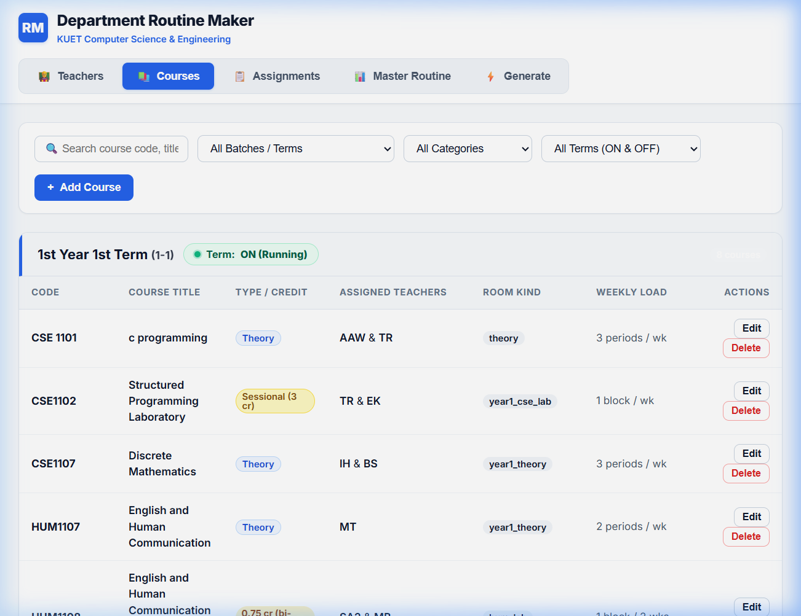

---

### Screenshot 2: Inactive Term Status Control
*Demonstrating term status toggled to `OFF`. Inactive terms display only syllabus details with no teachers assigned and are hidden from assignments.*

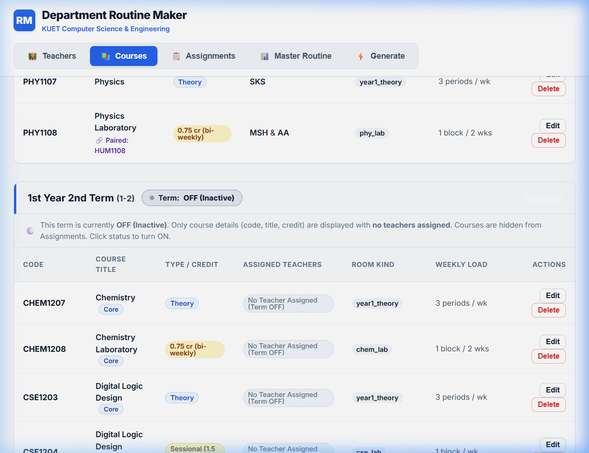

---

### Screenshot 3: 4th Year 2nd Term Course Tracks (Core & Electives)
*Categorized view of 4-2 showing Core Compulsory Courses, Optional-II Elective Theory, and Optional-III Elective Theory + Labs.*

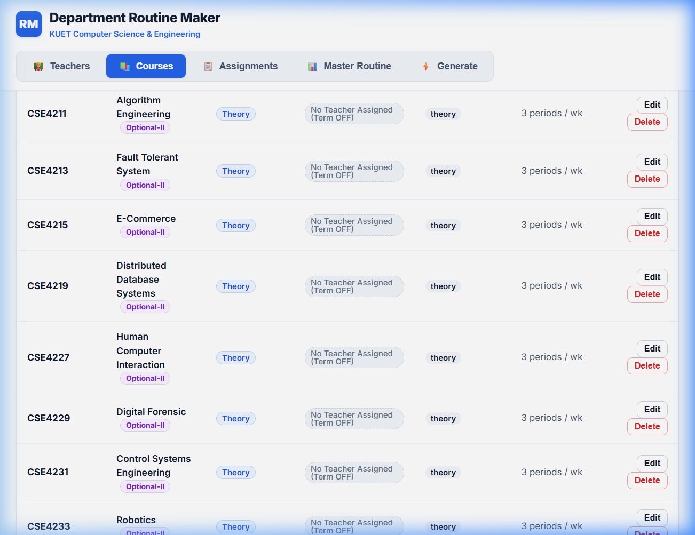

---

### Screenshot 4: Course Configuration & Lab Pairing Modal
*Modal allowing administrators to edit course parameters, set bi-weekly 0.75-credit pairings, allocate credit loads, and designate room types.*

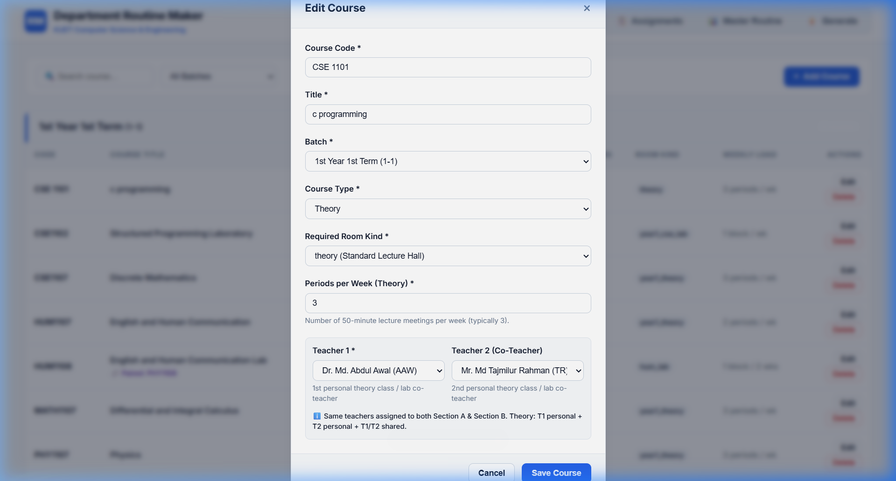

---

### Screenshot 5: Assignments Section for Active Running Terms
*Displays running terms in canonical sequence with term-wise course selection dropdowns for rapid teacher assignment.*

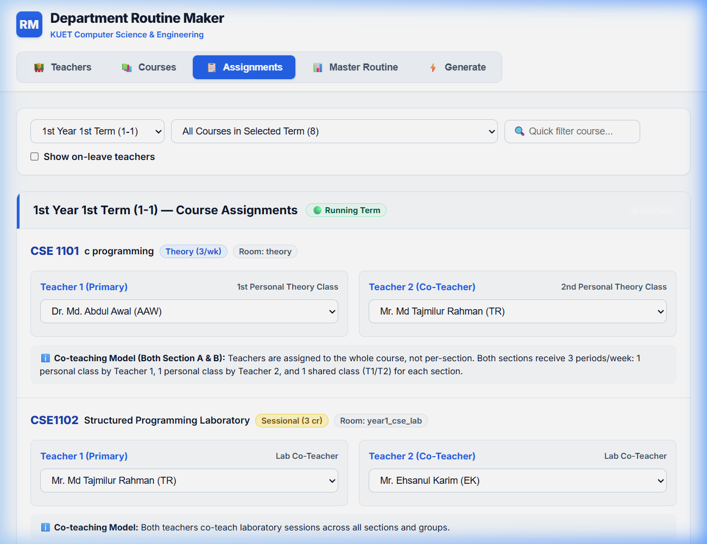

---

### Screenshot 6: Batches & Sections Master Routine
*Complete master routine plotting student sections in order ($1\text{-}1\text{A}, 1\text{-}1\text{B}, 2\text{-}1\text{A}, \dots$) with soft amber tints for labs and clear period divisions.*

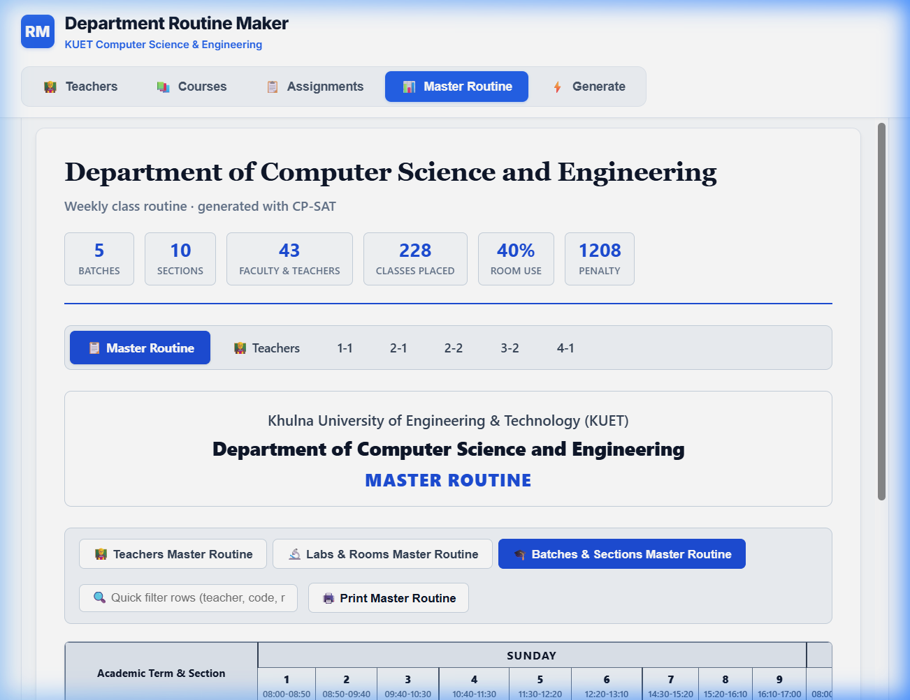

---

### Screenshot 7: Labs & Specialized Rooms Master Routine
*Dedicated laboratory allocation matrix showing simultaneous utilization of CSE Lab 103, CSE Lab 202, AI Lab, Network Lab, and Chemistry Lab.*

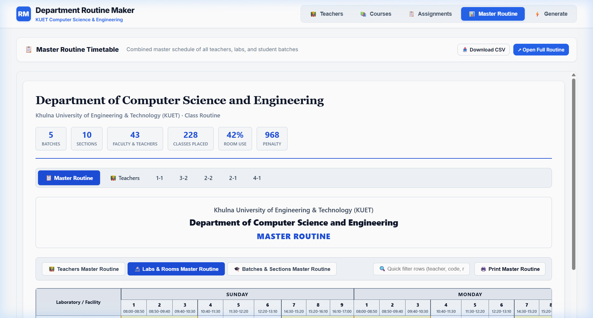

---

### Screenshot 8: Real-Time Master Routine Search
*Instant interactive filtering in the Master Routine tab isolating classes by professor, course code, or room across all days of the week.*

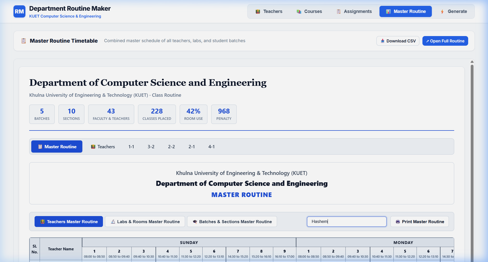

---

### Screenshot 9: Individual Teacher Routine Navigation
*Teacher-centric schedule view with dropdown search, quick navigation buttons, and one-click individual routine printing.*

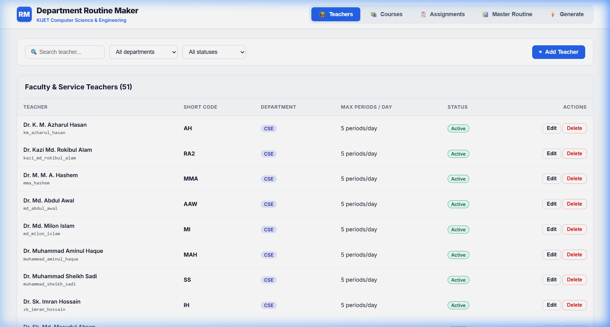

---

### Screenshot 10: Incremental / Freeze Generation Interface
*The generation control center featuring the Generation Strategy selector (Incremental vs Full) and the active terms freeze checklist.*

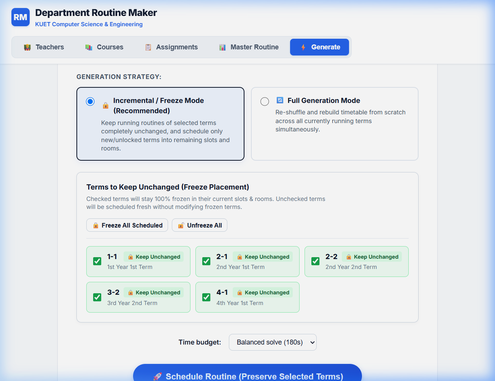

---

### Screenshot 11: Generation Completed with OPTIMAL Status and 0 Faults
*Execution result showing OPTIMAL solver status, 0 verification faults, and the mode indicator badge confirming terms remained frozen.*

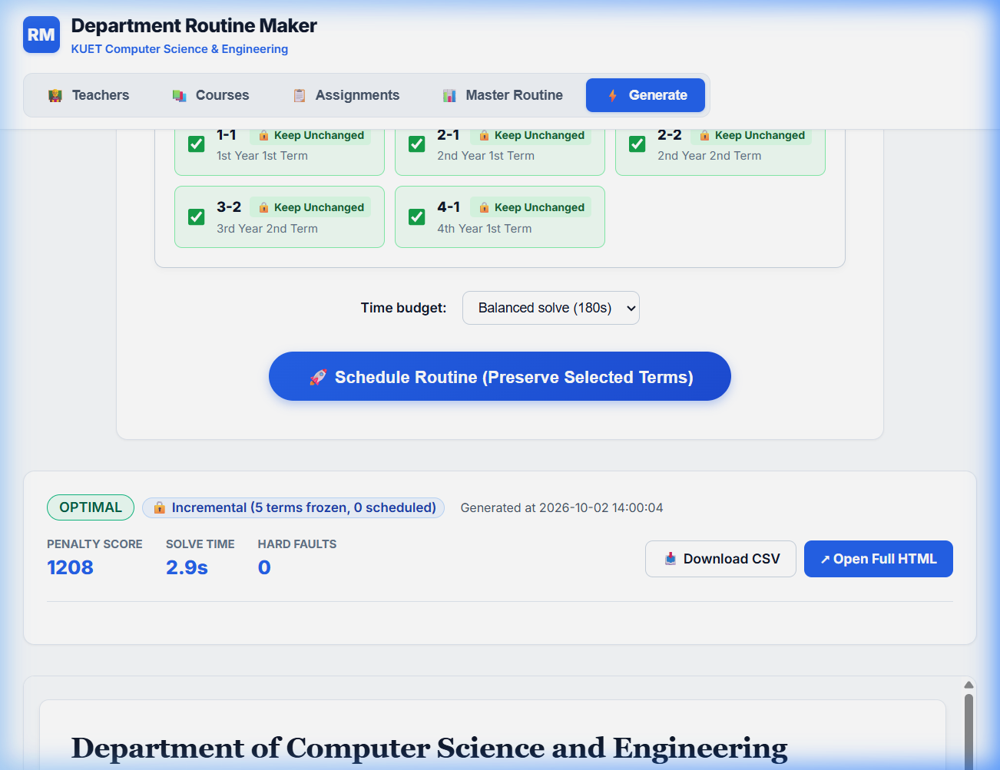

---

## 6. Operational Scenario: Preserving Running Routines

### Practical Scenario: Advancing 4th Year to Term 4-2
Suppose terms `1-1`, `2-1`, `2-2`, and `3-2` are actively ongoing. Term `4-1` finishes, and term `4-2` is ready to begin. The department must create a timetable for `4-2` **without moving any classes** of the ongoing batches.

#### Step-by-Step Procedure:
1. **Navigate to Courses Tab**:
   - Locate batch **`4-1`** and click its status button to toggle it **`⚪ Term: OFF`**.
   - Locate batch **`4-2`** and click its status button to toggle it **`🟢 Term: ON`**.
2. **Assign Teachers in Assignments Tab**:
   - In the Assignments tab, select `4th Year 2nd Term (4-2)`.
   - Assign faculty to the core courses (`CSE4000`, `IEM4227`, `HUM4207`) and the department's selected electives (e.g., `CSE4211` and `CSE4217/CSE4218`).
   - Elective courses without assigned teachers are automatically omitted from scheduling.
3. **Open Generate Routine Tab**:
   - The **Generation Strategy** is set to **`🔒 Incremental / Freeze Mode (Recommended)`** by default.
   - The system inspects `scheduled_assignments` in SQLite:
     - `1-1`, `2-1`, `2-2`, `3-2` have existing schedules $\to$ automatically **CHECKED** (`🔒 Keep Unchanged`).
     - `4-2` is a fresh term $\to$ automatically **UNCHECKED** (`⚡ Schedule Fresh`).
4. **Click "🚀 Schedule Routine"**:
   - The backend passes `freeze_map` containing all 178 placements of `1-1`, `2-1`, `2-2`, and `3-2` to `solve_routine()`.
   - CP-SAT pins all frozen classes with $x_{e, r^*, s^*} = 1$.
   - The solver identifies open laboratory rooms and theory slots, fitting `4-2` into the timetable in under 2 seconds.
5. **Outcome**:
   - Solver returns **`OPTIMAL`** with **`0 hard faults`**.
   - `1-1`, `2-1`, `2-2`, `3-2` remain 100% identical.
   - `4-2` is scheduled without a single clash.

---

## 7. Conclusion & System Summary

The **KUET CSE Routine Maker** combines the mathematical guarantees of constraint programming with a modern web interface tailored to university needs. 

By formalizing pedagogical rules, laboratory constraints, co-teaching models, and minimal-perturbation freeze algorithms into CP-SAT, the platform eliminates scheduling conflicts and reduces routine generation time from days of manual labor to **under two seconds**.

The system documentation and codebase provide a scalable foundation for academic scheduling, accreditation documentation, and administrative study at Khulna University of Engineering & Technology.
